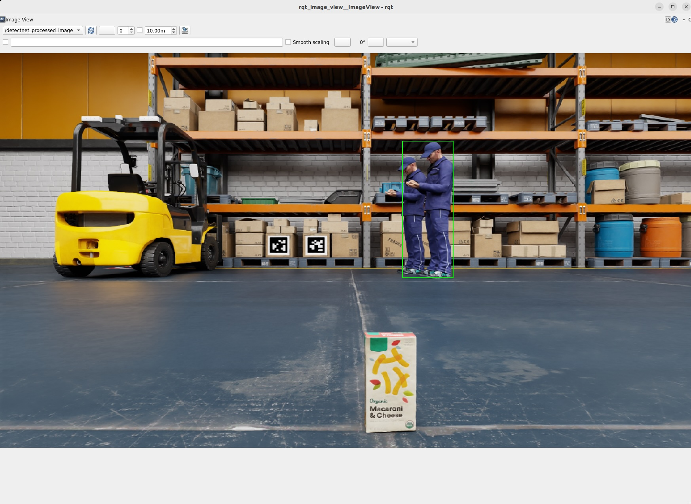

# RT-DETR

## Isaac SIMの起動

```
export ROS_DOMAIN_ID=1
```

Isaac SIMを起動。起動時にROS Bridgeを設定する。


## Jetson側のROSの設定

```
cd ${ISAAC_ROS_WS}/src/isaac_ros_common && \
./scripts/run_dev.sh
```

```
sudo apt update
sudo apt-get install -y ros-humble-isaac-ros-rtdetr
```

```
mkdir -p ${ISAAC_ROS_WS}/isaac_ros_assets/models/synthetica_detr && \
cd ${ISAAC_ROS_WS}/isaac_ros_assets/models/synthetica_detr && \
   wget 'https://api.ngc.nvidia.com/v2/models/nvidia/isaac/synthetica_detr/versions/1.0.0_onnx/files/sdetr_grasp.onnx'
```

## Jetson側のコマンド


PeopleNet Modelモデルをダウンロードし .onnx modelに変換(変換に5分程度かかります, Jetson AGX Orin)

```
ros2 run isaac_ros_detectnet setup_model.sh \
	--config-file peoplenet_config.pbtxt
```

Object Detectionを起動

```
ros2 launch isaac_ros_detectnet isaac_ros_detectnet_isaac_sim.launch.py
```



## ROS topic list

```
ros2 topic list
```

```
/back_stereo_imu/imu
/chassis/imu
/chassis/odom
/clock
/cmd_vel
/detectnet/detections
/detectnet/detections/nitros
/detectnet_encoder/converted/image
/detectnet_encoder/converted/image/nitros
/detectnet_encoder/crop/camera_info
/detectnet_encoder/crop/camera_info/nitros
/detectnet_encoder/crop/image
/detectnet_encoder/crop/image/nitros
/detectnet_encoder/crop/image/nitros/nitros_image_rgb8
/detectnet_encoder/image_tensor
/detectnet_encoder/image_tensor/nitros
/detectnet_encoder/normalized_tensor
/detectnet_encoder/normalized_tensor/nitros
/detectnet_encoder/planar_tensor
/detectnet_encoder/planar_tensor/nitros
/detectnet_encoder/resize/camera_info
/detectnet_encoder/resize/camera_info/nitros
/detectnet_encoder/resize/image
/detectnet_encoder/resize/image/nitros
/detectnet_processed_image
/front_3d_lidar/lidar_points
/front_stereo_camera/left/camera_info
/front_stereo_camera/left/camera_info/nitros
/front_stereo_camera/left/camera_info_resize
/front_stereo_camera/left/camera_info_resize/nitros
/front_stereo_camera/left/image_rect_color
/front_stereo_camera/left/image_rect_color/nitros
/front_stereo_camera/left/image_resize
/front_stereo_camera/left/image_resize/nitros
/left_stereo_imu/imu
/parameter_events
/right_stereo_imu/imu
/rosout
/tensor_pub
/tensor_pub/nitros
/tensor_sub
/tensor_sub/nitros
/tf
```

## Orin Nova Developer Kitのカメラの場合

```
cd ${ISAAC_ROS_WS}/src/isaac_ros_common && \
./scripts/run_dev.sh
```

```
sudo apt-get update
sudo apt-get install -y ros-humble-isaac-ros-examples \
	ros-humble-isaac-ros-argus-camera
```

```
ros2 launch isaac_ros_examples isaac_ros_examples.launch.py launch_fragments:=argus_mono,rectify_mono,rtdetr  engine_file_path:=${ISAAC_ROS_WS}/isaac_ros_assets/models/synthetica_detr/sdetr_grasp.plan
```

## Reference

- [Tutorial for RT-DETR with Isaac Sim](https://nvidia-isaac-ros.github.io/concepts/object_detection/rtdetr/tutorial_isaac_sim.html)
- [isaac_ros_rtdetr](https://nvidia-isaac-ros.github.io/repositories_and_packages/isaac_ros_object_detection/isaac_ros_rtdetr/index.html)
- [Isaac Sim Tutorials](https://nvidia-isaac-ros.github.io/getting_started/index.html#isaac-sim-tutorials)
- [Isaac ROS Object Detection](https://nvidia-isaac-ros.github.io/repositories_and_packages/isaac_ros_object_detection/index.html)