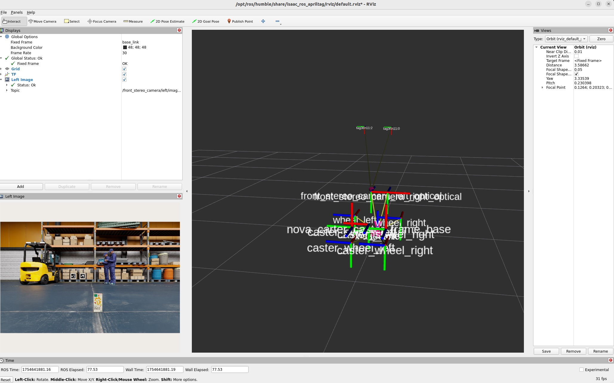
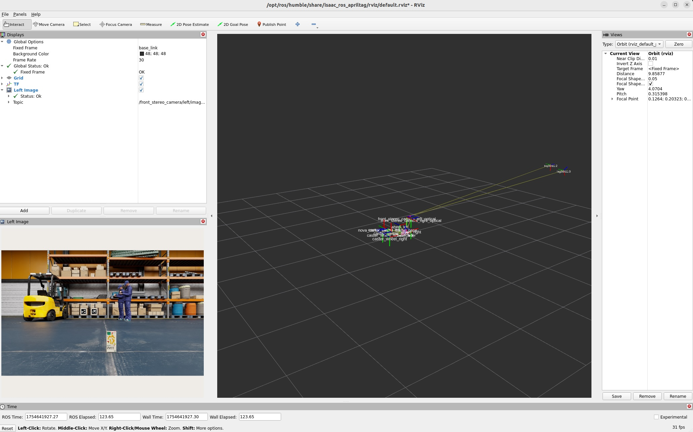

# Apritag Detection

## Isaac SIMの起動

```
export ROS_DOMAIN_ID=1
```

Isaac SIMを起動。起動時にROS Bridgeを設定する。


## Jetson側のROSの設定

```
cd ${ISAAC_ROS_WS}/src/isaac_ros_common && \
./scripts/run_dev.sh
```

```
sudo apt update
sudo apt-get install -y ros-humble-nova-developer-kit-bringup 
source /opt/ros/humble/setup.bash
```

## Jetson側のコマンド

apritag detection起動用とrviz2起動用に、Terminalを2つだしておく。

```
ros2 launch isaac_ros_apriltag isaac_ros_apriltag_isaac_sim_pipeline.launch.py
```

```
rviz2 -d $(ros2 pkg prefix isaac_ros_apriltag --share)/rviz/default.rviz
```






## ROS topic list

```
ros2 topic list
```

```
/back_stereo_imu/imu
/chassis/imu
/chassis/odom
/clock
/cmd_vel
/front_3d_lidar/lidar_points
/front_stereo_camera/left/camera_info
/front_stereo_camera/left/image_rect_color
/front_stereo_camera/left/image_rect_color/nitros
/front_stereo_camera/right/camera_info
/front_stereo_camera/right/image_rect_color
/front_stereo_imu/imu
/left_stereo_imu/imu
/parameter_events
/right_stereo_imu/imu
/rosout
/tag_detections
/tf
```

## Orin Nova Developer Kitのカメラの場合

```
cd ${ISAAC_ROS_WS}/src/isaac_ros_common && \
./scripts/run_dev.sh
```

```
sudo apt-get update
sudo apt-get install -y ros-humble-isaac-ros-apriltag
sudo apt-get install -y ros-humble-isaac-ros-examples ros-humble-isaac-ros-argus-camera
```

```
ros2 launch isaac_ros_examples isaac_ros_examples.launch.py launch_fragments:=argus_mono,rectify_mono,apriltag
```

## Reference

- [Tutorial for AprilTag Detection with Isaac Sim](https://nvidia-isaac-ros.github.io/concepts/fiducials/apriltag/tutorial_isaac_sim.html)
- [Isaac ROS AprilTag](https://nvidia-isaac-ros.github.io/repositories_and_packages/isaac_ros_apriltag/index.html)
- [Isaac Sim Tutorials](https://nvidia-isaac-ros.github.io/getting_started/index.html#isaac-sim-tutorials)
- [Isaac ROS AprilTag](https://nvidia-isaac-ros.github.io/repositories_and_packages/isaac_ros_apriltag/index.html)
