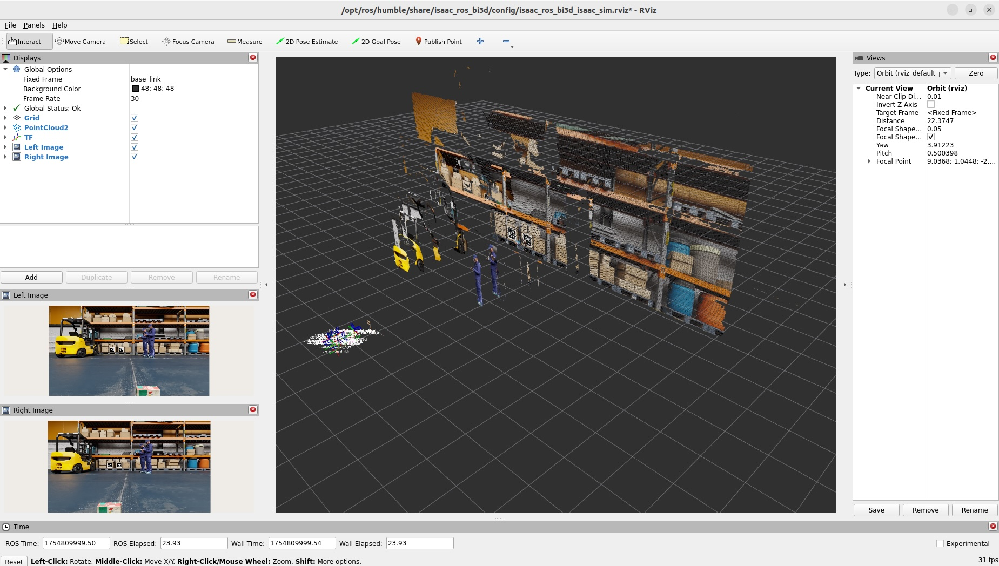

# Bi3D

## Isaac SIMの起動

```
export ROS_DOMAIN_ID=1
```

Isaac SIMを起動。起動時にROS Bridgeを設定する。


## Jetson側のROSの設定

```
cd ${ISAAC_ROS_WS}/src/isaac_ros_common && \
./scripts/run_dev.sh
```

```
sudo apt update
sudo apt-get install -y ros-humble-nova-developer-kit-bringup 
source /opt/ros/humble/setup.bash
```

```
mkdir -p ${ISAAC_ROS_WS}/isaac_ros_assets/models/bi3d_proximity_segmentation && \
cd ${ISAAC_ROS_WS}/isaac_ros_assets/models/bi3d_proximity_segmentation && \
wget 'https://api.ngc.nvidia.com/v2/models/nvidia/isaac/bi3d_proximity_segmentation/versions/2.0.0/files/featnet.onnx' &&
wget 'https://api.ngc.nvidia.com/v2/models/nvidia/isaac/bi3d_proximity_segmentation/versions/2.0.0/files/segnet.onnx'
```

```
sudo apt-get install -y ros-humble-isaac-ros-bi3d
```

## Jetson側のコマンド

```
export ROS_DOMAIN_ID=1
```

```
ros2 launch isaac_ros_bi3d isaac_ros_bi3d_isaac_sim.launch.py \
featnet_engine_file_path:=${ISAAC_ROS_WS}/isaac_ros_assets/models/bi3d_proximity_segmentation/featnet.plan segnet_engine_file_path:=${ISAAC_ROS_WS}/isaac_ros_assets/models/bi3d_proximity_segmentation/segnet.plan
```




## Reference

- [Tutorial for Bi3D with Isaac Sim](https://nvidia-isaac-ros.github.io/concepts/stereo_depth/bi3d/tutorial_isaac_sim.html)
- [isaac_ros_bi3d](https://nvidia-isaac-ros.github.io/repositories_and_packages/isaac_ros_depth_segmentation/isaac_ros_bi3d/index.html)
- [Isaac Sim Tutorials](https://nvidia-isaac-ros.github.io/getting_started/index.html#isaac-sim-tutorials)
