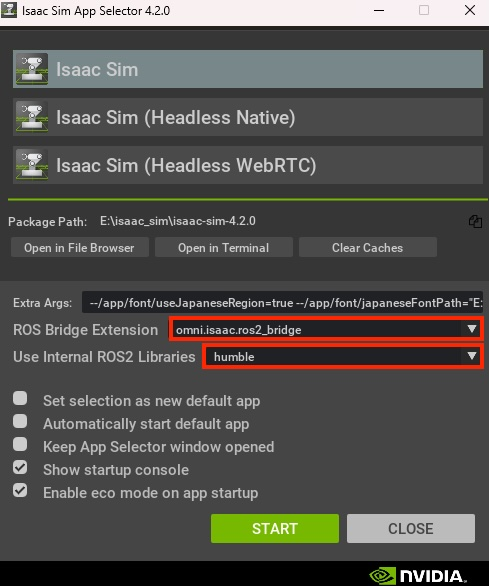
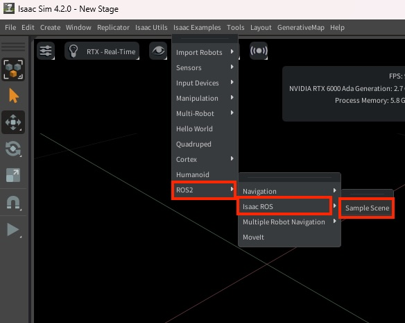
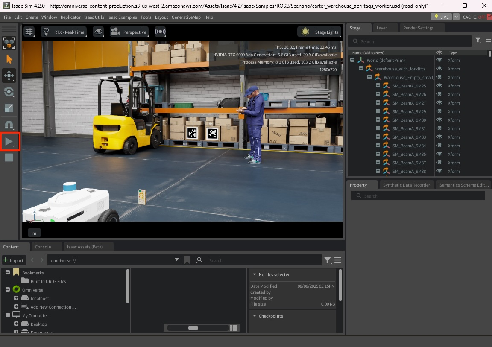

# FoundationPose

## Isaac SIMの起動

```
export ROS_DOMAIN_ID=1
```

Isaac SIMを起動。起動時にROS Bridgeを設定する。









## Jetson側のROSの設定

```
cd ${ISAAC_ROS_WS}/src/isaac_ros_common && \
./scripts/run_dev.sh
```

```
sudo apt update
sudo apt-get install -y ros-humble-isaac-ros-foundationpose
```

モデルのダウンロード

```
mkdir -p ${ISAAC_ROS_WS}/isaac_ros_assets/models/foundationpose && \
   cd ${ISAAC_ROS_WS}/isaac_ros_assets/models/foundationpose && \
   wget 'https://api.ngc.nvidia.com/v2/models/nvidia/isaac/foundationpose/versions/1.0.0_onnx/files/refine_model.onnx' -O refine_model.onnx && \
   wget 'https://api.ngc.nvidia.com/v2/models/nvidia/isaac/foundationpose/versions/1.0.0_onnx/files/score_model.onnx' -O score_model.onnx
```

.onnx形式をTensorRTに変換

```
/usr/src/tensorrt/bin/trtexec --onnx=${ISAAC_ROS_WS}/isaac_ros_assets/models/foundationpose/refine_model.onnx --saveEngine=${ISAAC_ROS_WS}/isaac_ros_assets/models/foundationpose/refine_trt_engine.plan --minShapes=input1:1x160x160x6,input2:1x160x160x6 --optShapes=input1:1x160x160x6,input2:1x160x160x6 --maxShapes=input1:42x160x160x6,input2:42x160x160x6
```

```
/usr/src/tensorrt/bin/trtexec --onnx=${ISAAC_ROS_WS}/isaac_ros_assets/models/foundationpose/score_model.onnx --saveEngine=${ISAAC_ROS_WS}/isaac_ros_assets/models/foundationpose/score_trt_engine.plan --minShapes=input1:1x160x160x6,input2:1x160x160x6 --optShapes=input1:1x160x160x6,input2:1x160x160x6 --maxShapes=input1:252x160x160x6,input2:252x160x160x6
```

SyntheticaDETRモデルのダウンロード

```
mkdir -p ${ISAAC_ROS_WS}/isaac_ros_assets/models/synthetica_detr && \
cd ${ISAAC_ROS_WS}/isaac_ros_assets/models/synthetica_detr && \
   wget 'https://api.ngc.nvidia.com/v2/models/nvidia/isaac/synthetica_detr/versions/1.0.0_onnx/files/sdetr_grasp.onnx'
```

.onnx形式をTensorRTに変換

```
/usr/src/tensorrt/bin/trtexec --onnx=${ISAAC_ROS_WS}/isaac_ros_assets/models/synthetica_detr/sdetr_grasp.onnx --saveEngine=${ISAAC_ROS_WS}/isaac_ros_assets/models/synthetica_detr/sdetr_grasp.plan
```

essのインストール

```
sudo apt-get install -y ros-humble-isaac-ros-ess && \
   sudo apt-get install -y ros-humble-isaac-ros-ess-models-install
```

```
ros2 run isaac_ros_ess_models_install install_ess_models.sh --eula
```

## Jetson側のコマンド

```
ros2 launch isaac_ros_foundationpose isaac_ros_foundationpose_isaac_sim.launch.py
```

エラーが発生

```
[component_container_mt-1] [INFO] [1754810706.789572590] [foundationpose_node]: [NitrosNode] Initializing and running GXF graph
[component_container_mt-1] 2025-08-10 16:25:06.791 ERROR ./gxf/foundationpose/mesh_storage.cpp@172: [MeshStorage] Mesh file does not exist at path: /workspaces/isaac_ros-dev/isaac_ros_assets/isaac_ros_foundationpose/Mac_and_cheese_0_1/Mac_and_cheese_0_1.obj
[component_container_mt-1] 2025-08-10 16:25:06.791 ERROR ./gxf/foundationpose/mesh_storage.cpp@75: [MeshStorage] Failed to load mesh file
[component_container_mt-1] 2025-08-10 16:25:06.791 ERROR gxf/std/entity_warden.cpp@548: Failed to initialize component 01199 (mesh_storage)
[component_container_mt-1] 2025-08-10 16:25:06.791 ERROR gxf/core/runtime.cpp@742: Could not initialize entity 'LLDQUDGGGR_utils' (E1194): GXF_FAILURE
[component_container_mt-1] 2025-08-10 16:25:06.791 ERROR gxf/std/program.cpp@289: Failed to activate entity 01194 named LLDQUDGGGR_utils: GXF_FAILURE
[component_container_mt-1] 2025-08-10 16:25:06.791 ERROR gxf/std/program.cpp@291: Deactivating...
[component_container_mt-1] 2025-08-10 16:25:06.791 ERROR gxf/core/runtime.cpp@777: Could not unschedule entity 'LLDQUDGGGR_utils' (E1194) from execution: GXF_ENTITY_COMPONENT_NOT_FOUND
[component_container_mt-1] 2025-08-10 16:25:06.791 ERROR gxf/std/program.cpp@293: Deactivation failed.
[component_container_mt-1] 2025-08-10 16:25:06.791 ERROR gxf/core/runtime.cpp@1625: Graph activation failed with error: GXF_FAILURE
[component_container_mt-1] [ERROR] [1754810706.791766382] [foundationpose_node]: [NitrosContext] GxfGraphActivate Error: GXF_FAILURE
[component_container_mt-1] [ERROR] [1754810706.791838798] [foundationpose_node]: [NitrosNode] runGraphAsync Error: GXF_FAILURE
[component_container_mt-1] terminate called after throwing an instance of 'std::runtime_error'
[component_container_mt-1]   what():  [NitrosNode] runGraphAsync Error: GXF_FAILURE
[ERROR] [component_container_mt-1]: process has died [pid 135936, exit code -6, cmd '/opt/ros/humble/lib/rclcpp_components/component_container_mt --ros-args -r __node:=foundationpose_container -r __ns:=/'].
```


## ROS topic list

```
ros2 topic list
```

```
/back_stereo_imu/imu
/chassis/imu
/chassis/odom
/clock
/cmd_vel
/detectnet/detections
/detectnet/detections/nitros
/detectnet_encoder/converted/image
/detectnet_encoder/converted/image/nitros
/detectnet_encoder/crop/camera_info
/detectnet_encoder/crop/camera_info/nitros
/detectnet_encoder/crop/image
/detectnet_encoder/crop/image/nitros
/detectnet_encoder/crop/image/nitros/nitros_image_rgb8
/detectnet_encoder/image_tensor
/detectnet_encoder/image_tensor/nitros
/detectnet_encoder/normalized_tensor
/detectnet_encoder/normalized_tensor/nitros
/detectnet_encoder/planar_tensor
/detectnet_encoder/planar_tensor/nitros
/detectnet_encoder/resize/camera_info
/detectnet_encoder/resize/camera_info/nitros
/detectnet_encoder/resize/image
/detectnet_encoder/resize/image/nitros
/detectnet_processed_image
/front_3d_lidar/lidar_points
/front_stereo_camera/left/camera_info
/front_stereo_camera/left/camera_info/nitros
/front_stereo_camera/left/camera_info_resize
/front_stereo_camera/left/camera_info_resize/nitros
/front_stereo_camera/left/image_rect_color
/front_stereo_camera/left/image_rect_color/nitros
/front_stereo_camera/left/image_resize
/front_stereo_camera/left/image_resize/nitros
/left_stereo_imu/imu
/parameter_events
/right_stereo_imu/imu
/rosout
/tensor_pub
/tensor_pub/nitros
/tensor_sub
/tensor_sub/nitros
/tf
```

## Orin Nova Developer Kitのカメラの場合

```
cd ${ISAAC_ROS_WS}/src/isaac_ros_common && \
./scripts/run_dev.sh
```

```
sudo apt-get update
sudo apt-get install -y ros-humble-isaac-ros-examples \
	ros-humble-isaac-ros-argus-camera
```

```
ros2 launch isaac_ros_examples isaac_ros_examples.launch.py launch_fragments:=argus_mono,rectify_mono,rtdetr  engine_file_path:=${ISAAC_ROS_WS}/isaac_ros_assets/models/synthetica_detr/sdetr_grasp.plan
```

## Reference

- [Tutorial for FoundationPose with Isaac Sim](https://nvidia-isaac-ros.github.io/concepts/pose_estimation/foundationpose/tutorial_isaac_sim.html)
- [isaac_ros_foundationpose](https://nvidia-isaac-ros.github.io/repositories_and_packages/isaac_ros_pose_estimation/isaac_ros_foundationpose/index.html)
- [Isaac Sim Tutorials](https://nvidia-isaac-ros.github.io/getting_started/index.html#isaac-sim-tutorials)
