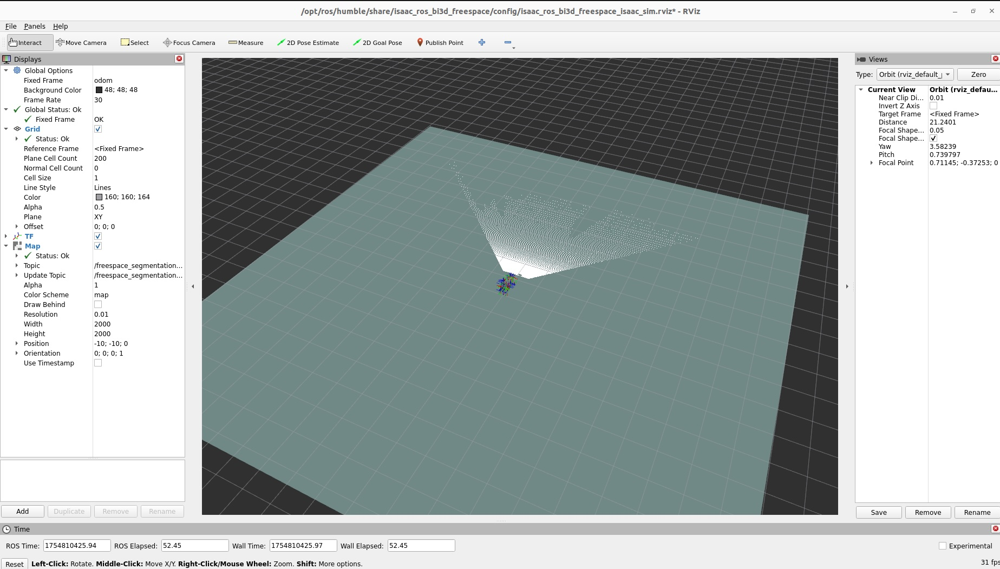
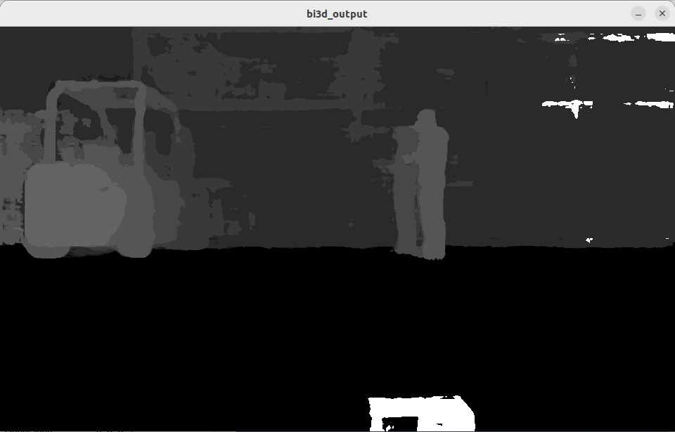

# Freespace segmentation

## Isaac SIMの起動

```
export ROS_DOMAIN_ID=1
```

Isaac SIMを起動。起動時にROS Bridgeを設定する。


## Jetson側のROSの設定

```
cd ${ISAAC_ROS_WS}/src/isaac_ros_common && \
./scripts/run_dev.sh
```

```
sudo apt update
sudo apt-get install -y ros-humble-nova-developer-kit-bringup 
source /opt/ros/humble/setup.bash
```

```
sudo apt-get install -y ros-humble-isaac-ros-bi3d-freespace
sudo apt-get install -y ros-humble-isaac-ros-bi3d
```

## Jetson側のコマンド(Terminal1)

Isaac SIMの起動しているPCのROS_DOMAIN_IDと同じIDを指定します。

```
export ROS_DOMAIN_ID=1
```

```
ros2 launch isaac_ros_bi3d_freespace isaac_ros_bi3d_freespace_isaac_sim.launch.py \
featnet_engine_file_path:=${ISAAC_ROS_WS}/isaac_ros_assets/models/bi3d_proximity_segmentation/featnet.plan \
segnet_engine_file_path:=${ISAAC_ROS_WS}/isaac_ros_assets/models/bi3d_proximity_segmentation/segnet.plan \
max_disparity_values:=32
```



## Jetson側のコマンド(Terminal2)

```
cd ${ISAAC_ROS_WS}/src/isaac_ros_common && \
./scripts/run_dev.sh
```

Isaac SIMの起動しているPCのROS_DOMAIN_IDと同じIDを指定します。


```
export ROS_DOMAIN_ID=1
```

```
ros2 run isaac_ros_bi3d isaac_ros_bi3d_visualizer.py --disparity_topic bi3d_mask
```




## ROS topic list

```
ros2 topic list
```

```
/back_stereo_imu/imu
/chassis/imu
/chassis/odom
/clock
/cmd_vel
/detectnet/detections
/detectnet/detections/nitros
/detectnet_encoder/converted/image
/detectnet_encoder/converted/image/nitros
/detectnet_encoder/crop/camera_info
/detectnet_encoder/crop/camera_info/nitros
/detectnet_encoder/crop/image
/detectnet_encoder/crop/image/nitros
/detectnet_encoder/crop/image/nitros/nitros_image_rgb8
/detectnet_encoder/image_tensor
/detectnet_encoder/image_tensor/nitros
/detectnet_encoder/normalized_tensor
/detectnet_encoder/normalized_tensor/nitros
/detectnet_encoder/planar_tensor
/detectnet_encoder/planar_tensor/nitros
/detectnet_encoder/resize/camera_info
/detectnet_encoder/resize/camera_info/nitros
/detectnet_encoder/resize/image
/detectnet_encoder/resize/image/nitros
/detectnet_processed_image
/front_3d_lidar/lidar_points
/front_stereo_camera/left/camera_info
/front_stereo_camera/left/camera_info/nitros
/front_stereo_camera/left/camera_info_resize
/front_stereo_camera/left/camera_info_resize/nitros
/front_stereo_camera/left/image_rect_color
/front_stereo_camera/left/image_rect_color/nitros
/front_stereo_camera/left/image_resize
/front_stereo_camera/left/image_resize/nitros
/left_stereo_imu/imu
/parameter_events
/right_stereo_imu/imu
/rosout
/tensor_pub
/tensor_pub/nitros
/tensor_sub
/tensor_sub/nitros
/tf
```

## Orin Nova Developer Kitのカメラの場合

```
cd ${ISAAC_ROS_WS}/src/isaac_ros_common && \
./scripts/run_dev.sh
```

```
sudo apt-get update
sudo apt-get install -y ros-humble-isaac-ros-examples \
	ros-humble-isaac-ros-argus-camera
```

```
ros2 run isaac_ros_detectnet setup_model.sh --config-file peoplenet_config.pbtxt
```

```
ros2 launch isaac_ros_examples isaac_ros_examples.launch.py \
	launch_fragments:=argus_mono,rectify_mono,detectnet
```

## Reference

- [Tutorial for DNN Object Detection with Isaac Sim](https://nvidia-isaac-ros.github.io/concepts/object_detection/detectnet/tutorial_isaac_sim.html)
- [isaac_ros_detectnet](https://nvidia-isaac-ros.github.io/repositories_and_packages/isaac_ros_object_detection/isaac_ros_detectnet/index.html#quickstart)
- [Isaac Sim Tutorials](https://nvidia-isaac-ros.github.io/getting_started/index.html#isaac-sim-tutorials)
