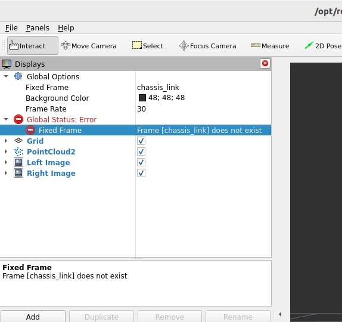

# SGM Stereo Disparity

## Isaac SIMの起動

```
export ROS_DOMAIN_ID=1
```

Isaac SIMを起動。起動時にROS Bridgeを設定する。


## Jetson側のROSの設定

```
cd ${ISAAC_ROS_WS}/src/isaac_ros_common && \
./scripts/run_dev.sh
```

```
sudo apt update
sudo apt-get install -y ros-humble-nova-developer-kit-bringup 
source /opt/ros/humble/setup.bash
```

```
sudo apt-get install -y  ros-humble-isaac-ros-image-proc ros-humble-isaac-ros-stereo-image-proc
```

## Jetson側のコマンド

```
export ROS_DOMAIN_ID=1
```

```
ros2 launch isaac_ros_stereo_image_proc isaac_ros_stereo_image_pipeline_isaac_sim.launch.py
```



## Reference

- [Tutorial with Isaac Sim](https://nvidia-isaac-ros.github.io/concepts/stereo_depth/sgm/tutorial_isaac_sim.html)
- [isaac_ros_stereo_image_proc](https://nvidia-isaac-ros.github.io/repositories_and_packages/isaac_ros_image_pipeline/isaac_ros_stereo_image_proc/index.html)
- [Isaac Sim Tutorials](https://nvidia-isaac-ros.github.io/getting_started/index.html#isaac-sim-tutorials)
