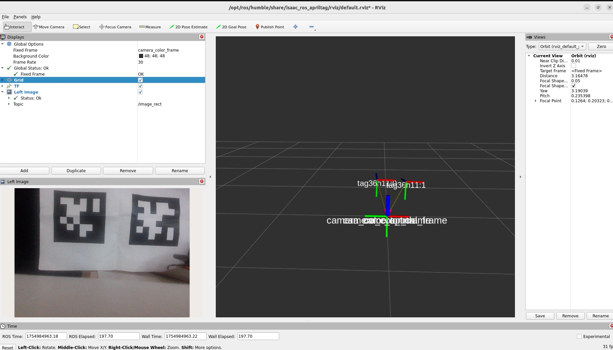

# Apriltag Detection

## Jetson(Terminal1)

```
cd ${ISAAC_ROS_WS}/src/isaac_ros_common && \
./scripts/run_dev.sh
```

```
sudo apt update
sudo apt-get install -y ros-humble-nova-developer-kit-bringup 
source /opt/ros/humble/setup.bash
```

```
sudo apt-get install -y ros-humble-isaac-ros-apriltag
sudo apt-get install -y ros-humble-isaac-ros-examples ros-humble-isaac-ros-realsense
```

```
ros2 launch isaac_ros_examples isaac_ros_examples.launch.py launch_fragments:=realsense_mono_rect,apriltag
```

## Jetson(Terminal2)

```
cd ${ISAAC_ROS_WS}/src/isaac_ros_common && \
./scripts/run_dev.sh
```

```
rviz2 -d $(ros2 pkg prefix isaac_ros_apriltag --share)/rviz/default.rviz
```

!!!Warning
	動作は1fps〜2fps程度。RealsenseのUSB経由での映像転送で大きく性能がfpsが遅くなる。




## Reference

- [Tutorial for AprilTag Detection with Isaac Sim](https://nvidia-isaac-ros.github.io/concepts/fiducials/apriltag/tutorial_isaac_sim.html)
- [Isaac ROS AprilTag](https://nvidia-isaac-ros.github.io/repositories_and_packages/isaac_ros_apriltag/index.html)
- [Isaac Sim Tutorials](https://nvidia-isaac-ros.github.io/getting_started/index.html#isaac-sim-tutorials)
- [Isaac ROS AprilTag](https://nvidia-isaac-ros.github.io/repositories_and_packages/isaac_ros_apriltag/index.html)
- [isaac_ros_apriltag/isaac_ros_apriltag/launch/isaac_ros_apriltag_core.launch.py](https://github.com/NVIDIA-ISAAC-ROS/isaac_ros_apriltag/blob/main/isaac_ros_apriltag/launch/isaac_ros_apriltag_core.launch.py)
- [AprilRobotics/apriltag](https://github.com/AprilRobotics/apriltag)
- [Apriltag tag36h11](https://docs.cbteeple.com/robot/april-tags#:~:text=floating%20around%20(like-,this%20one,-)%20with%20one%20april)
