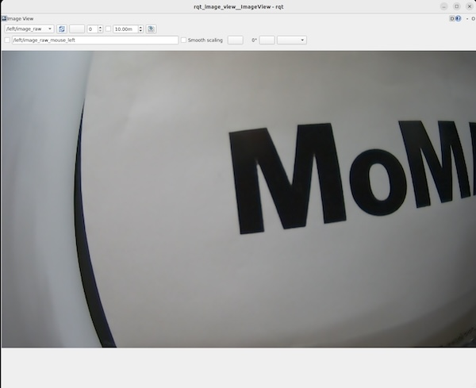
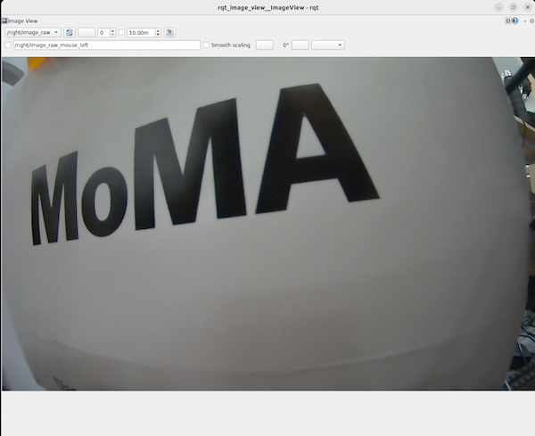
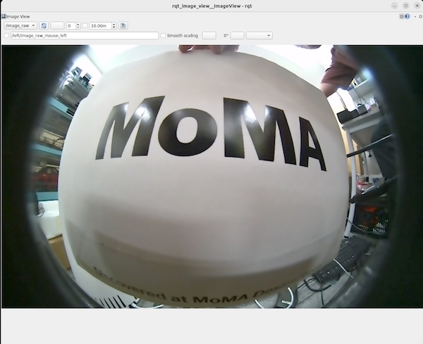
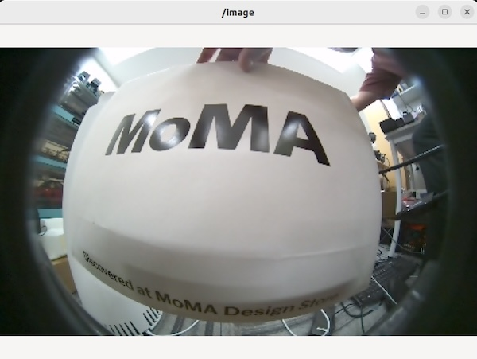
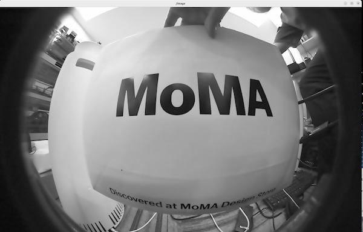
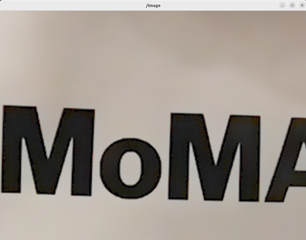
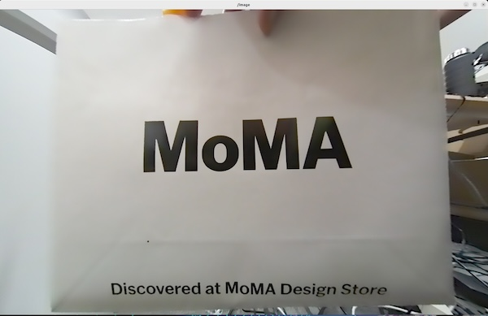
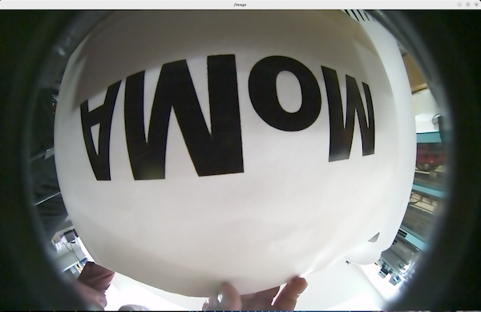

# Argus Camera

!!!Info
    Argus Cameraのパッケージは、CSIもしくはGMSL2で接続されたカメラで使用可能です。USBカメラでは使用できません。

## Arguc Camera

Jetson のハードウェア ISP（Image Signal Processor）に対応しているカメラに対して、CPUメモリコピーを経由せずに、カメラ画像を直接GPUメモリに移動可能なフレームワーク。マルチカメラでの100μs以下で、フレーム周期が可能。USBカメラは非対応。

## NVIDIAが動作確認したカメラ

|Camera名|カメラ種類|Connector|解像度/フレームレート|H/V FOV|シャッター|
|:--|:--|:--|:--|:--|:--|
|LI-AR0234CS-STEREO-GMSL2|ステレオカメラ|GMSL|1920x1200(60fps)|121/73|グローバル|
|LI-AR0234CS-GMSL2-OWL|Fisheyeカメラ|GMSL|1920x1200(60fps)|121/73|グローバル|
|IMX477|Monocularカメラ|CSI|4056x3040(60fps)|140/103|グローバル|
|IMX219|Monocularカメラ|CSI|3264x2464(21fps)|90/90|ローリング|


## Dockerの起動

```
cd ${ISAAC_ROS_WS}/src/isaac_ros_common && \
./scripts/run_dev.sh
```

```
sudo apt-get update
sudo apt-get install -y ros-humble-isaac-ros-argus-camera
```

```
sudo apt-get install -y ros-humble-isaac-ros-examples
```

## Hawkカメラ(Stereoカメラ)

1つめのTerminal

```
ros2 launch isaac_ros_examples isaac_ros_examples.launch.py launch_fragments:=argus_stereo
```

2つめのTerminal

```
cd ${ISAAC_ROS_WS}/src/isaac_ros_common && \
  ./scripts/run_dev.sh
```

```
ros2 run rqt_image_view rqt_image_view /left/image_raw
```



```
ros2 run rqt_image_view rqt_image_view /right/image_raw
```




## Owlカメラ(Fisheyeカメラ)

```
ros2 launch isaac_ros_examples isaac_ros_examples.launch.py launch_fragments:=argus_mono
```

2つめのTerminal

```
cd ${ISAAC_ROS_WS}/src/isaac_ros_common && \
  ./scripts/run_dev.sh
```

```
ros2 run rqt_image_view rqt_image_view /image_raw 
```



## カメラのPipeline動作(Fisheyeカメラ)


`リサイズ`

```
ros2 launch isaac_ros_examples isaac_ros_examples.launch.py launch_fragments:=argus_mono,resize
```

RVizでの確認

```
ros2 run image_view image_view --ros-args --remap image:=resize/image
```




`色変換`

```
ros2 launch isaac_ros_examples isaac_ros_examples.launch.py launch_fragments:=argus_mono,color_conversion
```

RVizでの確認

```
ros2 run image_view image_view --ros-args --remap image:=image_mono
```




`クロップ`

```
ros2 launch isaac_ros_examples isaac_ros_examples.launch.py launch_fragments:=argus_mono,crop
```

RVizでの確認

```
ros2 run image_view image_view --ros-args --remap image:=crop/image
```



`Rectify`

!!!info
    Rectifyは、魚眼レンズの歪み補正です。

```
ros2 launch isaac_ros_examples isaac_ros_examples.launch.py launch_fragments:=argus_mono,rectify_mono
```

RVizでの確認

```
ros2 run image_view image_view --ros-args --remap image:=image_rect
```




`Flip`

```
ros2 launch isaac_ros_examples isaac_ros_examples.launch.py launch_fragments:=argus_mono,flip
```

RVizでの確認

```
ros2 run image_view image_view --ros-args --remap image:=image_flipped
```




## Reference

- [Isaac ROS Argus Camera](https://nvidia-isaac-ros.github.io/v/release-3.2/repositories_and_packages/isaac_ros_argus_camera/index.html)
- [isaac_ros_argus_camera](https://nvidia-isaac-ros.github.io/v/release-3.2/repositories_and_packages/isaac_ros_argus_camera/isaac_ros_argus_camera/index.html)
- [isaac_ros_image_proc](https://nvidia-isaac-ros.github.io/v/release-3.1/repositories_and_packages/isaac_ros_image_pipeline/isaac_ros_image_proc/index.html)