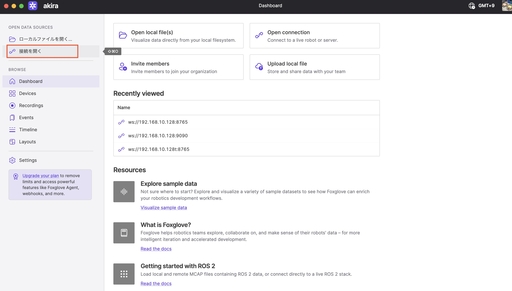
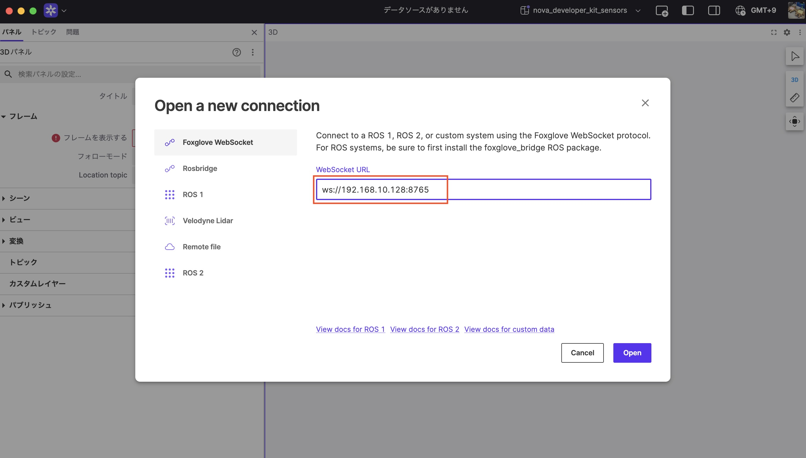
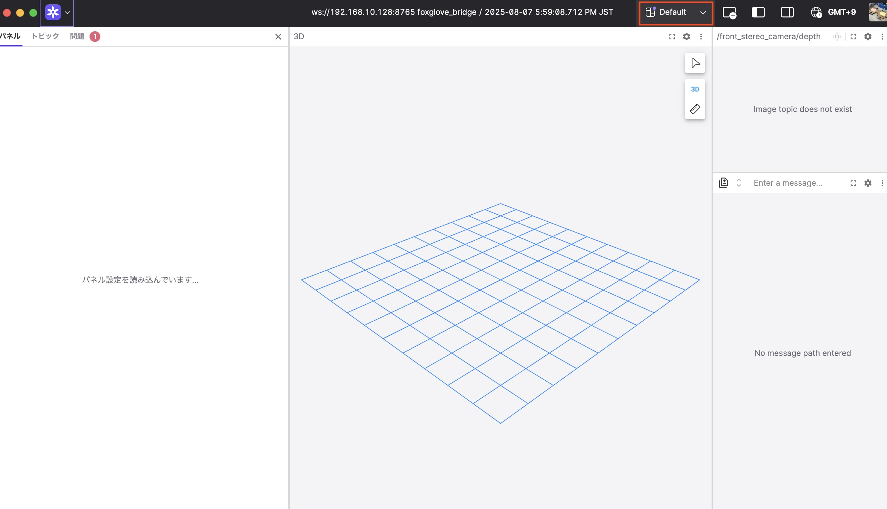
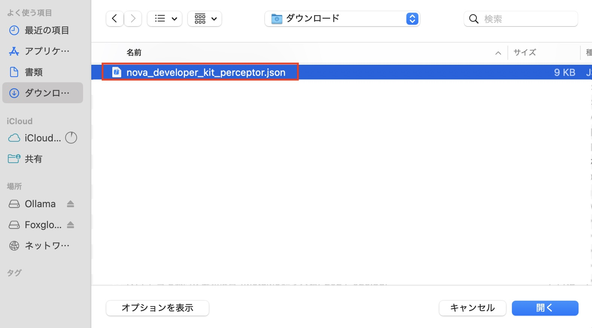
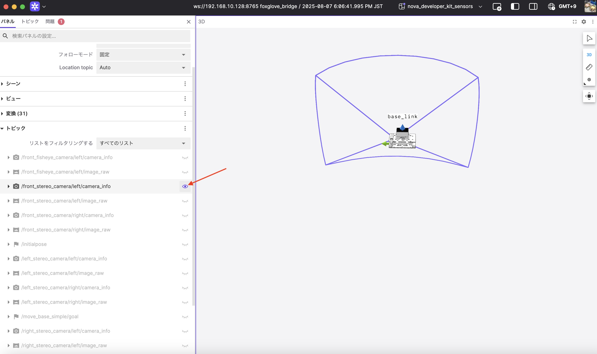
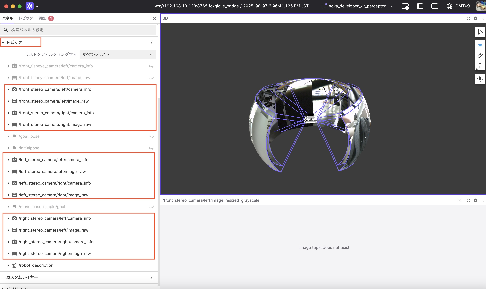
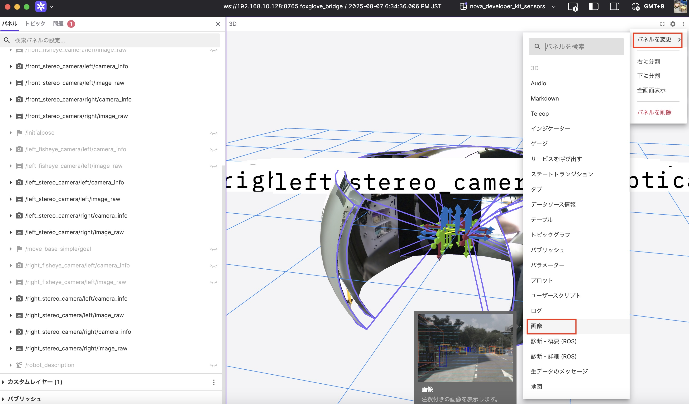
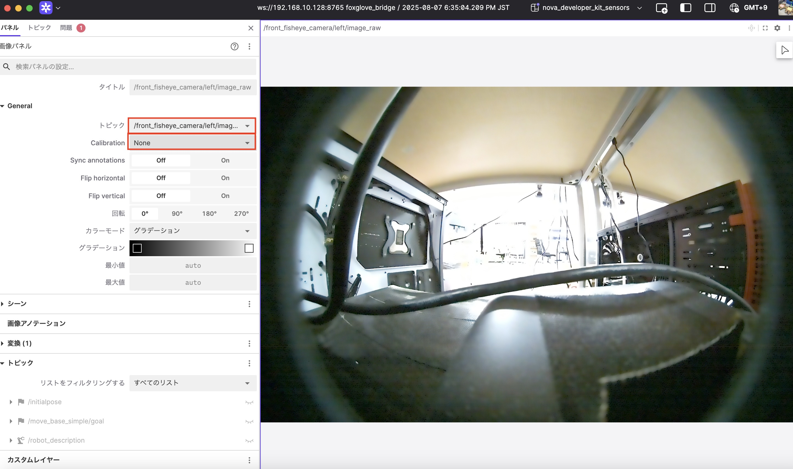

# Sensor

!!!Info
    Orin Nova Developer Kitで使用可能なセンサー一式を起動します。Depthカメラ x 3, 魚眼カメラ x 3, IMUが起動します。


## Sensorを全部起動する

```
docker pull nvcr.io/nvidia/isaac/nova_developer_kit_bringup:release_3.2-aarch64
```

```
docker run --privileged --network host \
    -v /dev/*:/dev/* \
    -v /tmp/argus_socket:/tmp/argus_socket \
    -v /etc/nova:/etc/nova \
    nvcr.io/nvidia/isaac/nova_developer_kit_bringup:release_3.2-aarch64 \
    ros2 launch nova_developer_kit_bringup sensors.launch.py
```


## Foxglobeで表示

[nova_developer_kit_bringup/foxglove_layouts](https://github.com/NVIDIA-ISAAC-ROS/nova_developer_kit/tree/main/nova_developer_kit_bringup/foxglove_layouts)から、nova_developer_kit_sensor.jsonをダウンロードする。
















## Fisheyeカメラも3つ表示する

```
docker run --privileged --network host \
    -v /dev/*:/dev/* \
    -v /tmp/argus_socket:/tmp/argus_socket \
    -v /etc/nova:/etc/nova \
    nvcr.io/nvidia/isaac/nova_developer_kit_bringup:release_3.2-aarch64 \
    ros2 launch nova_developer_kit_bringup sensors.launch.py \
    enabled_fisheye_cameras:=front_fisheye_camera,left_fisheye_camera,right_fisheye_camera
```






## 設定できる値とDefault値

```
docker run --privileged --network host \
    -v /dev/*:/dev/* \
    -v /tmp/argus_socket:/tmp/argus_socket \
    -v /etc/nova:/etc/nova \
    nvcr.io/nvidia/isaac/nova_developer_kit_bringup:release_3.2-aarch64 \
    ros2 launch nova_developer_kit_bringup sensors.launch.py \
    --show-args
```

```
Using container type: component_container_mt, with arguments: ['--ros-args', '--log-level', 'info']
Arguments (pass arguments as '<name>:=<value>'):

    'mode':
        One of: ['real_world', 'rosbag']
        (default: 'real_world')

    'rosbag':
        no description given
        (default: 'None')

    'enabled_stereo_cameras':
        no description given
        (default: 'front_stereo_camera,left_stereo_camera,right_stereo_camera')

    'enabled_fisheye_cameras':
        no description given
        (default: 'front_fisheye_camera')

    'type_negotiation_duration_s':
        no description given
        (default: '5')

    'urdf_override_file':
        no description given
        (default: 'None')

    'namespace':
        ROS namespace
        (default: 'hesai_lidar')

    'replay':
        Enable replay from rosbag
        (default: 'False')

    'ip':
        Hesai source IP address
        (default: '192.168.1.201')

    'run_foxglove':
        no description given
        (default: 'True')

    'run_rviz':
        no description given
        (default: 'False')

    'rviz_config':
        no description given
        (default: 'None')
```

## Reference

- [Tutorial: Run all Sensors on the Nova Orin Developer Kit](https://nvidia-isaac-ros.github.io/reference_workflows/isaac_perceptor/tutorials_on_devkit/demo_sensors.html)